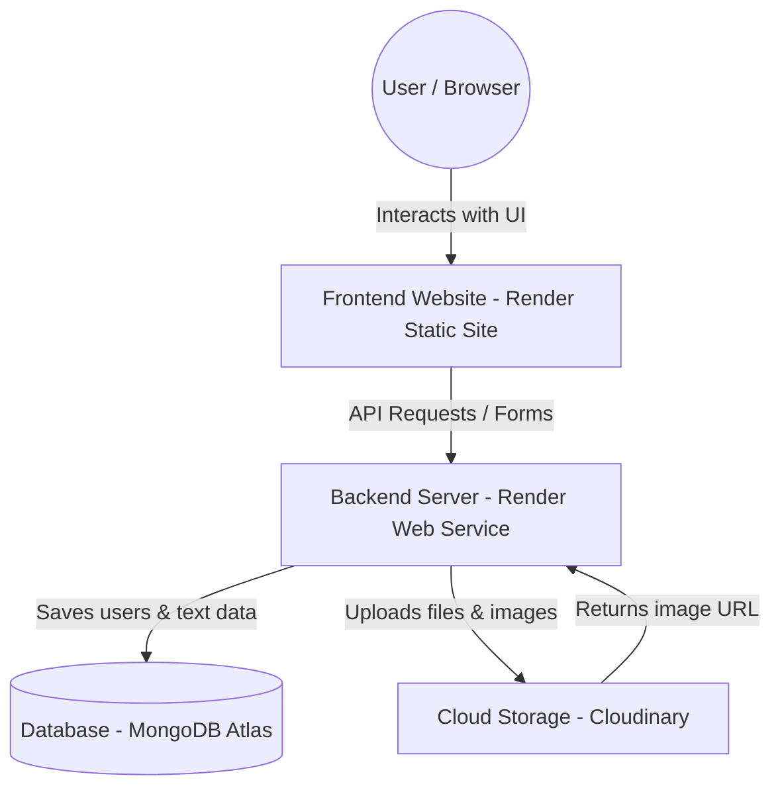

# 📋 Smart Complaint Resolution System (SCRS)

A full-stack **MERN** application for managing and resolving user complaints with role-based authentication and a clean REST API.

---

## 🚀 Features

- ✅ User Registration & Login
- 🔐 JWT Authentication
- 👥 Role-Based Access Control (Admin / User)
- 📝 Complaint Management (Create, Read, Update, Delete)
- 📁 File Upload Support (via Multer)
- 🗄️ MongoDB Database Integration
- 🌐 RESTful API

---

## 🛠️ Tech Stack

### Frontend
| Technology | Purpose |
|------------|---------|
| React | UI Library |
| Vite | Build Tool & Dev Server |
| CSS | Styling |
| Fetch API | HTTP Requests |

### Backend
| Technology | Purpose |
|------------|---------|
| Node.js | Runtime Environment |
| Express.js | Web Framework |
| MongoDB | NoSQL Database |
| Mongoose | ODM for MongoDB |
| JWT | Authentication Tokens |
| bcryptjs | Password Hashing |
| Multer | File Upload Handling |
| Cloudinary | Cloud-Based Media Storage |

---

## 📁 Folder Structure

```
scrs/
│
├── scrs-frontend/          # React + Vite frontend
│   ├── src/
│   │   ├── components/
│   │   ├── pages/
│   │   └── App.jsx
│   ├── public/
│   └── package.json
│
└── scrs-backend/           # Node.js + Express backend
    ├── controllers/
    ├── models/
    ├── routes/
    ├── middleware/
    ├── uploads/
    └── package.json
```

---

## ⚙️ Installation & Setup

### Prerequisites
- [Node.js](https://nodejs.org/) (v16 or higher)
- [MongoDB](https://www.mongodb.com/) (local or Atlas)
- npm

---

### 🔧 Backend Setup

```bash
cd scrs-backend
npm install
npm start
```

> The backend server will start on `http://localhost:5000` by default.

**Environment Variables** — Create a `.env` file inside `scrs-backend/`:

```env
PORT=5000
NODE_ENV=development
MONGO_URI=mongodb://127.0.0.1:27017/scrs_db
JWT_SECRET=your_jwt_secret_key
JWT_EXPIRES_IN=30d
FRONTEND_URL=http://localhost:3000
CLOUDINARY_CLOUD_NAME=your_cloudinary_cloud_name
CLOUDINARY_API_KEY=your_cloudinary_api_key
CLOUDINARY_API_SECRET=your_cloudinary_api_secret
```

---

### 💻 Frontend Setup

```bash
cd scrs-frontend
npm install
npm run dev
```

> The frontend dev server will start on `http://localhost:5173` by default.

---

## 🔑 API Overview

| Method | Endpoint | Description | Access |
|--------|----------|-------------|--------|
| POST | `/api/auth/register` | Register a new user | Public |
| POST | `/api/auth/login` | Login & get JWT token | Public |
| GET | `/api/complaints` | Get all complaints | Admin |
| POST | `/api/complaints` | Submit a new complaint | User |
| PUT | `/api/complaints/:id` | Update complaint status | Admin |
| DELETE | `/api/complaints/:id` | Delete a complaint | Admin |

---

## 🧑‍💼 User Roles

| Role | Permissions |
|------|-------------|
| **User** | Register, Login, Submit complaints, View own complaints |
| **Admin** | View all complaints, Update status, Delete complaints |

---

## 🌐 Deployment Setup (Render + MongoDB Atlas + Cloudinary)

This application is configured for seamless deployment on free-tier services without losing uploaded files.



### 1. Database Setup (MongoDB Atlas)
* Create a free cluster on MongoDB Atlas.
* Whitelist IP `0.0.0.0/0` under Network Access.
* Copy the connection string and replace `<password>`.

### 2. File Storage Setup (Cloudinary)
* Create a free Cloudinary account.
* Copy the Cloud name, API key, and API secret from your dashboard.

### 3. Deploy Backend (Render Web Service)
* **Root Directory**: `scrs-backend`
* **Build Command**: `npm install`
* **Start Command**: `npm start`
* **Environment Variables**: `NODE_ENV`, `MONGO_URI`, `JWT_SECRET`, `JWT_EXPIRES_IN`, `CLOUDINARY_CLOUD_NAME`, `CLOUDINARY_API_KEY`, `CLOUDINARY_API_SECRET`.

### 4. Deploy Frontend (Render Static Site)
* **Root Directory**: `scrs-frontend`
* **Build Command**: `npm run build`
* **Publish Directory**: `dist`
* **Environment Variables**:
  - `VITE_API_URL` = `https://your-backend.onrender.com/api`
  - `VITE_BACKEND_URL` = `https://your-backend.onrender.com`

---

## 📸 Screenshots

---

## 🤝 Contributing

Contributions, issues, and feature requests are welcome!

1. Fork the repository
2. Create your feature branch: `git checkout -b feature/your-feature`
3. Commit your changes: `git commit -m 'Add some feature'`
4. Push to the branch: `git push origin feature/your-feature`
5. Open a Pull Request

---

## 📄 License

This project is open source and available under the [MIT License](LICENSE).

---

## 👨‍💻 Author

**Maheshwaran**

- GitHub: [@Maheshwarandev](https://github.com/Maheshwarandev)

---

> Built with ❤️ using the MERN Stack
