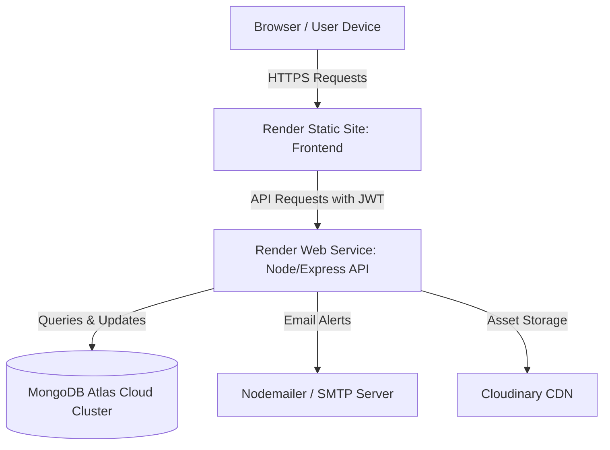

# 📋 Smart Complaint Resolution System (SCRS) Enterprise


[](LICENSE)
[](https://reactjs.org/)
[](https://vitejs.dev/)
[](https://nodejs.org/)
[](https://expressjs.com/)
[](https://www.mongodb.com/)

A full-stack **MERN** enterprise service desk and complaint resolution platform built for high-accountability team workflows. Features priority-based SLA countdown timers, automated email alerts via Nodemailer, intelligent least-busy agent auto-assignment, interactive conversation threads, 5-star CSAT ratings, in-app notification center, audit history timelines, and a signature **Obsidian 3-Layer Design System**.

---

## 🌟 Complete Enterprise Feature Matrix

```
┌──────────────────────────────────────────────────────────────────────────────────┐
│                               SCRS ENTERPRISE                                    │
├─────────────────────┬──────────────────────┬─────────────────────────────────────┤
│ ⏱️ SLA Engine       │ 🤖 Auto-Assign       │ 💬 Live Threads & History           │
│ Priority Timers     │ Workload Balancer    │ Audit Trails & Feedback             │
├─────────────────────┼──────────────────────┼─────────────────────────────────────┤
│ 📧 Nodemailer       │ 🔔 Notification Hub  │ 📊 Analytics & CSV Reports          │
│ HTML Email Alerts   │ Real-Time Dropdown   │ Multi-Filter Export                 │
└─────────────────────┴──────────────────────┴─────────────────────────────────────┘
```

### 1. ⏱️ SLA Timers & Breach Tracking Engine
* **Dynamic SLA Deadlines**: Automatically calculates target resolution deadlines on ticket submission based on priority:
  * 🔥 **Critical**: 4 Hours
  * 🔴 **High**: 24 Hours
  * 🟡 **Medium**: 48 Hours
  * 🟢 **Low**: 72 Hours
* **Live SLA Countdown Badge (`SLABadge.jsx`)**: Real-time minute-by-minute countdowns (`⏱️ 18h 30m left`), urgent deadline warnings (`🔥 2h left`), `⚠️ SLA Breached` alert tags for overdue tickets, and `✓ Resolved on track` compliance badges.
* **Admin SLA Bar**: Dashboard overview with clickable filters for overdue and on-track tickets.

### 2. 📧 Automated Email Notifications (Nodemailer)
* **Transactional Dark-Themed HTML Emails (`emailService.js`)**:
  1. **Ticket Creation**: Confirmation with SLA target date dispatched to complainant.
  2. **Agent Assignment**: Ticket brief, priority, and complainant info sent to assigned support agent.
  3. **Status Update / Resolution**: Instant alerts with resolution notes and 5-star feedback rating invitation.
  4. **Discussion Messages**: Real-time email notification when a reply is posted in the conversation thread.
* **Safe Delivery**: Gracefully falls back to local console preview mode when SMTP credentials are not configured.

### 3. 🤖 Smart Auto-Assignment & Load Balancer
* **Workload-Aware Routing (`autoAssign.js`)**: Evaluates active ticket queues (`Open` + `In Progress`) across all support agents.
* **Instant Load Balancing**: Automatically routes new complaints to the least-busy agent, moves status to `In Progress`, records the assignment in the audit trail, and notifies the agent.

### 4. 💬 Interactive Conversation & Discussion Threads
* **Ticket Messaging (`CommentThread.jsx`)**: Full back-and-forth communication between Complainant, Assigned Agent, and Administrator.
* **Differentiated Chat Bubbles**: User bubbles vs. Agent highlighted `brand-subtle` bubbles with role badges, user avatars, and relative timestamps (`2m ago`, `1h ago`).

### 5. ⭐ Customer Satisfaction (CSAT) & 5-Star Ratings
* **Feedback System (`StarRating.jsx`)**: Interactive 1-to-5 star rating and feedback input for resolved and closed tickets.
* **CSAT Analytics**: Real-time average CSAT calculation displayed across Admin and Agent dashboards.

### 6. 🔔 In-App Notification Center
* **Header Notification Bell (`NotificationBell.jsx`)**: Live unread counter badge with auto-polling.
* **Animated Dropdown**: Type-specific icons (⚡ assignment, 💬 comment, ⚠️ SLA warning, ⭐ rating) with relative timestamps and "Mark all as read".

### 7. 🛡️ Audit Trail & Activity Timeline History
* **Complete Chronological History (`ActivityTimeline.jsx`)**: Tracks previous value → new value for status changes, priority shifts, agent assignments, and resolution notes.
* **Accountability Stamping**: Records timestamp, performer name, and system/user/agent/admin role for every event.

### 8. 📊 Advanced Analytics, Search & CSV Reports
* **Multi-Field Real-Time Search**: Instant filtering by title, category, complainant, or assigned agent.
* **Status & Priority Tabs**: Quick tabs for `All`, `Open`, `In Progress`, `Resolved`, `Closed`, and `🔴 Overdue`.
* **One-Click CSV Export**: Instant generation of structured CSV reports across User, Agent, and Admin views.
* **Visual Progress Bars**: Dynamic breakdown charts for ticket statuses and categories.

### 9. 🔐 Multi-Role RBAC & Security
* **Stateless JWT Authentication**: Secure authorization with Axios request/response interceptors.
* **3 Dedicated Roles**: `User`, `Agent`, and `Admin` with route guards (`ProtectedRoute.jsx`).
* **Support Agent Passkey Verification**: Specialized security codes (e.g. `AGNT01`) for support personnel login.
* **Dynamic Password Strength Meter**: 4-segment real-time indicator on registration (Weak, Fair, Good, Strong).
* **Express Rate Limiting**: Brute-force protection on authentication endpoints.

### 10. 🎨 Enterprise Obsidian Design System
* **3-Layer Depth Palette**: Canvas (`#060910`), Surface (`#0D1117`), Elevated (`#161B22`).
* **Signature 4px Left-Bordered Complaint Cards**: Red for High/Critical, Amber for Medium, Green for Low (`border-radius: 0 8px 8px 0`).
* **Typography & Icons**: Google Fonts `Inter` + `JetBrains Mono` with Tabler Icons CDN (`ti ti-*`).
* **Drag-and-Drop Attachments**: Custom file upload zone with removable file chips.

---

## 🛠️ Tech Stack

### Frontend Architecture
| Technology | Purpose |
|------------|---------|
| **React 18** | Fast, component-driven reactive user interface |
| **Vite 5.4** | Ultra-fast build tool and development server |
| **React Router v6** | Client-side routing, protected routes & URL search params |
| **Axios** | HTTP client with automatic JWT bearer token interceptors |
| **Tabler Icons CDN** | High-contrast enterprise iconography |
| **Google Fonts** | `Inter` (UI typography) and `JetBrains Mono` (Code & Ticket IDs) |
| **CSS Variables** | Pure CSS design tokens supporting seamless Dark/Light themes |

### Backend Architecture
| Technology | Purpose |
|------------|---------|
| **Node.js & Express 5** | RESTful API server with modular controllers and routers |
| **MongoDB Atlas & Mongoose** | Cloud document database with strict schema validation & indexing |
| **JSON Web Tokens (JWT)** | Stateless authentication with 30-day token expiration |
| **bcryptjs** | Salted cryptographic password hashing |
| **Nodemailer** | Transactional SMTP email delivery with HTML templates |
| **Multer & Cloudinary** | Multi-part file upload processing and cloud media storage |
| **Express Rate Limit** | IP-based request throttling against brute-force attacks |

---

## 📁 Project Directory Structure

```
scrs/
├── README.md                       # Comprehensive enterprise documentation
│
├── scrs-frontend/                  # React + Vite Client Application
│   ├── index.html                  # HTML entry with Google Fonts & Tabler Icons CDN
│   └── src/
│       ├── api/                    # Axios client & modular API endpoints
│       │   ├── client.js           # Axios instance with JWT interceptor & 401 handler
│       │   ├── auth.js             # Login, register, profile APIs
│       │   ├── complaints.js       # Complaints CRUD, comments, ratings APIs
│       │   ├── admin.js            # Dashboard stats, user & agent management APIs
│       │   ├── notifications.js    # Notification fetching and mark-as-read APIs
│       │   └── index.js            # Barrel export — one import for all APIs
│       ├── components/             # Reusable UI components
│       │   ├── ActivityTimeline.jsx  # Chronological audit history trail
│       │   ├── AttachmentList.jsx    # Cloudinary file attachment list
│       │   ├── CommentThread.jsx     # Interactive conversation thread
│       │   ├── ConfirmModal.jsx      # Action confirmation dialog
│       │   ├── ErrorBoundary.jsx     # React crash boundary
│       │   ├── MainLayout.jsx        # Topbar + collapsible sidebar layout shell
│       │   ├── Navbar.jsx            # Topbar with theme toggle & notification bell
│       │   ├── NotificationBell.jsx  # In-app notification center with unread badge
│       │   ├── ProtectedRoute.jsx    # RBAC route authorization guard
│       │   ├── Sidebar.jsx           # Navigation sidebar with role-filtered links
│       │   ├── SLABadge.jsx          # Live countdown timer and SLA breach badge
│       │   ├── StarRating.jsx        # Interactive 5-star rating & CSAT feedback
│       │   └── index.jsx             # Barrel export + inline Spinner component
│       ├── context/                # Global React context providers
│       │   ├── AppContext.jsx      # Merged Auth + Theme context (state & providers)
│       │   └── index.js            # Barrel export — one import for all contexts
│       ├── pages/                  # Route views (organized by role)
│       │   ├── admin/              # Admin-only views
│       │   │   ├── AdminDashboard.jsx
│       │   │   ├── ManageComplaints.jsx
│       │   │   ├── ManageUsers.jsx
│       │   │   └── ManageAgents.jsx
│       │   ├── agent/              # Agent-only views
│       │   │   ├── AgentDashboard.jsx
│       │   │   └── AgentComplaints.jsx
│       │   ├── auth/               # Public authentication views
│       │   │   ├── Login.jsx       # Login with agent security code field
│       │   │   └── Register.jsx    # Registration with password strength meter
│       │   ├── user/               # Standard user portals
│       │   │   ├── Dashboard.jsx
│       │   │   ├── MyComplaints.jsx
│       │   │   └── SubmitComplaint.jsx
│       │   └── Profile.jsx         # Shared profile page (all roles)
│       ├── utils/                  # Pure helper utilities (no UI, no React)
│       │   ├── complaintsHelpers.js  # Shared getPriorityClass & getStatusBadgeClass
│       │   └── csvExporter.js        # Universal CSV report generator
│       ├── constants.js            # Shared system roles, categories, priorities
│       ├── App.jsx                 # Route definitions & role-based redirects
│       ├── main.jsx                # React DOM mount root
│       └── index.css               # Design tokens, variables & base component styles
│
└── scrs-backend/                   # Node.js + Express REST API
    ├── config/
    │   └── db.js                   # Mongoose connection with IPv4/DNS fallback
    ├── controllers/                # Business logic handlers
    │   ├── authController.js       # Authentication & profile logic
    │   ├── complaintController.js  # Complaint CRUD, SLA, email triggers & comments
    │   ├── adminController.js      # System analytics, role updates & user management
    │   └── notificationController.js # Notification retrieval & read state
    ├── middleware/
    │   ├── authMiddleware.js       # JWT verification & RBAC authorization
    │   └── uploadMiddleware.js     # Multer file upload handler (memory storage)
    ├── models/
    │   ├── User.js                 # User schema with bcrypt & security code
    │   ├── Complaint.js            # Complaint schema with SLA, comments, history
    │   └── Notification.js         # In-app notification schema
    ├── routes/
    │   ├── authRoutes.js           # /api/auth
    │   ├── complaintRoutes.js      # /api/complaints
    │   ├── adminRoutes.js          # /api/admin
    │   └── notificationRoutes.js   # /api/notifications
    ├── utils/
    │   ├── autoAssign.js           # Least-busy agent load balancer
    │   ├── cloudinary.js           # Cloudinary config + upload helper (merged)
    │   ├── emailService.js         # Nodemailer dispatcher & HTML email templates
    │   ├── constants.js            # Roles, priorities, SLA hours, statuses, categories
    │   ├── errorHandler.js         # AppError class, asyncHandler & global error middleware
    │   └── validators.js           # Input sanitization & validation functions
    ├── app.js                      # Express app setup, CORS, rate limiting & routes
    ├── server.js                   # Server entry — DB connect, admin seed, listen
    ├── seed_demo_data.js           # Quick demo seed (small dataset)
    ├── seed_testing_dataset.js     # Full test dataset (10 users, 6 agents, 2 admins, 20 tickets)
    └── package.json
```

---

## 🔧 Code Quality & Architecture

### Refactoring Applied (Sept 2026)
| Change | Details |
|--------|---------|
| **Merged Contexts** | `AuthContext.jsx` + `ThemeContext.jsx` → single `AppContext.jsx` |
| **Merged Cloudinary** | `config/cloudinary.js` + `utils/uploadHelper.js` → `utils/cloudinary.js` |
| **Extracted Shared Helpers** | `getPriorityClass` + `getStatusBadgeClass` extracted to `utils/complaintsHelpers.js` (were copy-pasted in 3 files) |
| **Inlined Spinner** | `Spinner.jsx` (17 lines) inlined into `components/index.jsx` barrel |
| **Dead Code Removed** | Unused `handleLogout` in Navbar, dead `getComplaintByIdAPI` & `getComplaintStatsAPI` in frontend API, legacy `/admin` duplicate route |
| **Constants Consistency** | All hardcoded `'admin'`/`'agent'`/`'user'` strings replaced with `ROLES.*` constants throughout backend |
| **asyncHandler Consistency** | `notificationController` unified to use `asyncHandler` like all other controllers |
| **Security** | Admin seed password moved to `process.env.ADMIN_DEFAULT_PASSWORD` |

---

## 🔑 Pre-Seeded Testing Accounts & Credentials

The database is pre-seeded with **10 Users**, **6 Support Agents**, **2 Admins**, and **20 Enterprise Complaints**.

### 1. 🛡️ Administrators (Full System Access)
| Name | Email | Password | Role |
| :--- | :--- | :--- | :--- |
| **Chief Admin** | `admin@scrs.com` | `adminpassword123` | `admin` |
| **Operations Admin** | `ops.admin@scrs.com` | `AdminPass123!` | `admin` |

### 2. 🎧 Support Engineers / Agents (Queue Management)
| Name | Email | Password | Security Passkey |
| :--- | :--- | :--- | :--- |
| **Alex Mercer** | `agent.alex@scrs.com` | `AgentPass123!` | `AGNT01` |
| **Maya Lin** | `agent.maya@scrs.com` | `AgentPass123!` | `AGNT02` |
| **Samuel Vance** | `agent.samuel@scrs.com` | `AgentPass123!` | `AGNT03` |
| **Elena Rostova** | `agent.elena@scrs.com` | `AgentPass123!` | `AGNT04` |
| **Kevin Hart** | `agent.kevin@scrs.com` | `AgentPass123!` | `AGNT05` |
| **Rachel Green** | `agent.rachel@scrs.com` | `AgentPass123!` | `AGNT06` |

### 3. 👤 Standard Users (Ticket Submitters)
* **Common Password for All Users**: `Password123!`

| Name | Email | Sample Complaint Filed |
| :--- | :--- | :--- |
| **John Doe** | `john.doe@scrs.com` | Core Switch Failure in Server Room B (`network`) |
| **Sarah Connor** | `sarah.connor@scrs.com` | Overcharged on AWS Enterprise Invoice (`finance`) |
| **Michael Chang** | `michael.chang@scrs.com` | Production Database SSD Degradation (`hardware` - 🔴 Overdue) |
| **Emily Blunt** | `emily.blunt@scrs.com` | SSO Login Token Expiry Loop on Firefox (`software` - ★ 5.0) |
| **David Miller** | `david.miller@scrs.com` | Ergonomic Desk Adjustment Floor 4 (`maintenance`) |
| **Jessica Alba** | `jessica.alba@scrs.com` | Missing Overtime Hours on August Payslip (`hr`) |
| **Robert Downey** | `robert.downey@scrs.com` | Access Badge Clearance for Prototype Lab (`infrastructure` - ★ 5.0) |
| **Priya Sharma** | `priya.sharma@scrs.com` | Visitor Parking Permit Registration (`general`) |
| **Daniel Craig** | `daniel.craig@scrs.com` | Phishing Email Campaign Impersonation (`security` - ★ 5.0) |
| **Lisa Kudrow** | `lisa.kudrow@scrs.com` | UPS Battery Backup Audible Alarm (`electrical` - ★ 5.0) |

---

## ⚙️ Local Installation & Setup

### Prerequisites
- [Node.js](https://nodejs.org/) (v18 or v20+ recommended)
- [MongoDB](https://www.mongodb.com/) (Local MongoDB instance or MongoDB Atlas URI)
- Git & npm

---

### 🔧 1. Backend Setup

1. Navigate to `scrs-backend` and install dependencies:
   ```powershell
   cd scrs-backend
   npm install
   ```

2. Create a `.env` file in `scrs-backend/`:
   ```env
   PORT=5000
   NODE_ENV=development
   MONGO_URI=mongodb+srv://<username>:<password>@cluster0.t9zyrqz.mongodb.net/scrs_db?retryWrites=true&w=majority
   JWT_SECRET=super_secret_enterprise_jwt_key_2026
   JWT_EXPIRES_IN=30d
   FRONTEND_URL=http://localhost:5173

   # Admin seed account (used only if no admin exists in DB on first run)
   ADMIN_DEFAULT_EMAIL=admin@scrs.com
   ADMIN_DEFAULT_PASSWORD=adminpassword123

   # Optional: Nodemailer SMTP (omit to run in console preview mode)
   SMTP_HOST=smtp.gmail.com
   SMTP_PORT=587
   SMTP_USER=your_email@gmail.com
   SMTP_PASS=your_app_specific_password
   EMAIL_FROM="SCRS Enterprise Desk" <support@scrs.com>

   # Optional: Cloudinary (omit to skip file uploads)
   CLOUDINARY_CLOUD_NAME=your_cloud_name
   CLOUDINARY_API_KEY=your_api_key
   CLOUDINARY_API_SECRET=your_api_secret
   ```

3. Seed the full testing dataset:
   ```powershell
   node seed_testing_dataset.js
   ```

4. Start the backend development server:
   ```powershell
   npm run dev
   # Server starts at http://localhost:5000
   ```

---

### 💻 2. Frontend Setup

1. Navigate to `scrs-frontend` and install dependencies:
   ```powershell
   cd scrs-frontend
   npm install
   ```

2. Create a `.env` file in `scrs-frontend/`:
   ```env
   VITE_API_URL=http://localhost:5000/api
   VITE_BACKEND_URL=http://localhost:5000
   ```

3. Start the Vite development server:
   ```powershell
   npm run dev
   # Frontend runs at http://localhost:5173
   ```

4. Build for production:
   ```powershell
   npm run build
   # Compiled assets stored in dist/
   ```

---

## 🔑 REST API Reference

### 🔐 Authentication (`/api/auth`)
| Method | Endpoint | Description | Access |
|:---|:---|:---|:---|
| `POST` | `/api/auth/register` | Register a new user account | Public |
| `POST` | `/api/auth/login` | Authenticate user/agent/admin and receive JWT token | Public |
| `GET` | `/api/auth/me` | Fetch currently authenticated user profile | Protected |
| `PUT` | `/api/auth/profile` | Update profile information and Cloudinary avatar | Protected |

### 📝 Complaints & Resolution (`/api/complaints`)
| Method | Endpoint | Description | Access |
|:---|:---|:---|:---|
| `POST` | `/api/complaints` | Submit ticket (computes SLA, auto-assigns agent, sends emails) | User |
| `GET` | `/api/complaints` | Fetch complaints (filtered by user/agent/admin role) | Protected |
| `GET` | `/api/complaints/stats` | Retrieve status & priority breakdown statistics | Agent / Admin |
| `GET` | `/api/complaints/:id` | Get single complaint with comments & history trail | Protected |
| `PUT` | `/api/complaints/:id` | Update status, priority, resolution note or assignment | Protected |
| `DELETE`| `/api/complaints/:id` | Delete an open ticket | Admin / Ticket Owner |
| `POST` | `/api/complaints/:id/comments` | Post a message in the ticket discussion thread | Protected |
| `POST` | `/api/complaints/:id/rate` | Submit 1-to-5 star rating and feedback review | Ticket Owner |

### 🔔 Notifications (`/api/notifications`)
| Method | Endpoint | Description | Access |
|:---|:---|:---|:---|
| `GET` | `/api/notifications` | Fetch user notifications and unread counter | Protected |
| `PUT` | `/api/notifications/:id/read` | Mark a specific notification as read | Protected |
| `PUT` | `/api/notifications/read-all` | Mark all notifications as read | Protected |

### 🛡️ Admin Management (`/api/admin`)
| Method | Endpoint | Description | Access |
|:---|:---|:---|:---|
| `GET` | `/api/admin/dashboard` | Retrieve system KPIs, SLA breaches & category counts | Admin |
| `GET` | `/api/admin/users` | List all registered user accounts | Admin |
| `GET` | `/api/admin/agents` | List all support agents with active workloads | Admin |
| `PUT` | `/api/admin/users/:id/role` | Promote/demote user roles (`user`, `agent`, `admin`) | Admin |
| `POST` | `/api/admin/agents/:id/generate-code` | Generate random security passkey for agent | Admin |
| `DELETE`| `/api/admin/users/:id` | Delete user account and associated complaint records | Admin |
| `PUT` | `/api/admin/complaints/:id/assign` | Manually assign a complaint to an agent | Admin |

---

## 🌐 Production Deployment Architecture


```mermaid
graph TD
    Client[Browser / User Device] -->|HTTPS Requests| Frontend[Render Static Site: Frontend]
    Frontend -->|API Requests with JWT| Backend[Render Web Service: Node/Express API]
    Backend -->|Queries & Updates| DB[(MongoDB Atlas Cloud Cluster)]
    Backend -->|Email Alerts| SMTP[Nodemailer / SMTP Server]
    Backend -->|Asset Storage| Cloudinary[Cloudinary CDN]
```

---

## 📄 License

This project is licensed under the [MIT License](LICENSE).

---

## 👨‍💻 Author

**Maheshwaran**
* GitHub: [@Maheshwarandev](https://github.com/Maheshwarandev)
* Repository: [smart-complaint-resolution-system](https://github.com/Maheshwarandev/smart-complaint-resolution-system)
