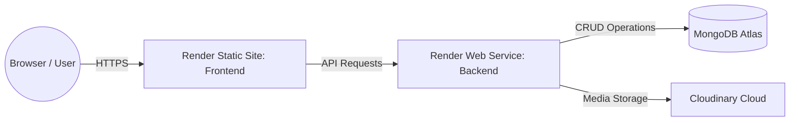

# 📋 Smart Complaint Resolution System (SCRS)

A modern, full-stack **MERN** enterprise complaint tracking and service desk management application featuring role-based access control (User, Agent, Admin), live activity timelines, star ratings, file attachments, and clean RESTful APIs.

---

## 🚀 Key Features

- 🔐 **Role-Based Authentication**: Secure JWT-based authentication for **Users**, **Support Agents**, and **Administrators**.
- 🛡️ **Support Agent Security Verification**: Specialized security code authentication for support personnel.
- 📝 **Complaint Lifecycle Management**: Complete CRUD workflow (Open → In Progress → Resolved → Closed).
- 💬 **Interactive Comment Threads**: Real-time discussions between complainants, assigned agents, and admins.
- 📁 **Attachment Support**: Upload images & supporting documents via Multer with Cloudinary integration.
- ⭐ **Feedback & Star Rating**: Complainants can rate resolutions and leave feedback upon resolution.
- 📊 **Dynamic Dashboards**: Real-time analytics, status breakdowns, and resolution metrics tailored to each role.
- ⚡ **One-Click Demo Logins**: Fast testing with pre-configured demo credentials on the login screen.
- 🌓 **Dark & Light Mode**: Theme switching with CSS variable design tokens.
- 📥 **CSV Data Export**: Instant complaint reports export for agents and administrators.

---

## 🛠️ Tech Stack

### Frontend
| Technology | Purpose |
|------------|---------|
| React (v18) | Component-driven UI library |
| Vite | Modern lightning-fast build tool & dev server |
| React Router (v6) | Declarative client-side routing & protected routes |
| Axios | Configured HTTP client with JWT interceptors |
| Vanilla CSS Tokens | Glassmorphic, modern responsive UI with Theme Context |

### Backend
| Technology | Purpose |
|------------|---------|
| Node.js & Express | Fast, scalable backend REST API runtime |
| MongoDB & Mongoose | Document database with schema validation & relationships |
| JSON Web Tokens (JWT) | Stateless authorization & route protection |
| bcryptjs | Strong password hashing |
| Multer & Cloudinary | File upload middleware and cloud asset storage |
| Express Rate Limit | Brute-force protection on authentication endpoints |

---

## 📁 Project Structure

```
scrs/
├── scrs-frontend/          # React + Vite Client Application
│   ├── src/
│   │   ├── api/            # Consolidated Axios client & API endpoints
│   │   │   └── index.js
│   │   ├── components/     # UI & Layout components + barrel export
│   │   │   ├── ActivityTimeline.jsx
│   │   │   ├── AttachmentList.jsx
│   │   │   ├── CommentThread.jsx
│   │   │   ├── ConfirmModal.jsx
│   │   │   ├── MainLayout.jsx
│   │   │   ├── Navbar.jsx
│   │   │   ├── ProtectedRoute.jsx
│   │   │   ├── Sidebar.jsx
│   │   │   ├── Spinner.jsx
│   │   │   ├── StarRating.jsx
│   │   │   └── index.js
│   │   ├── context/        # Consolidated Auth & Theme State Providers + Hooks
│   │   │   └── index.jsx   # (AuthProvider, useAuth, ThemeProvider, useTheme)
│   │   ├── pages/          # Application views
│   │   │   ├── admin/      # Admin dashboard, manage users, agents & complaints
│   │   │   ├── agent/      # Agent dashboard & assigned complaints management
│   │   │   ├── auth/       # Login (with quick demo logins) & Registration
│   │   │   ├── user/       # User dashboard, complaint submission & tracking
│   │   │   └── Profile.jsx # User profile & avatar update
│   │   ├── utils/          # Client utilities (CSV Exporter)
│   │   ├── constants.js    # System roles, categories & priorities
│   │   ├── App.jsx         # App router & role-based redirection
│   │   ├── main.jsx        # React DOM render root
│   │   └── index.css       # Design system & dark mode tokens
│   ├── public/             # Static assets & icons
│   └── package.json
│
└── scrs-backend/           # Node.js + Express REST API
    ├── config/             # Database connection & Cloudinary setup
    ├── controllers/        # Business logic (auth, complaint, admin)
    ├── middleware/         # JWT authentication & Multer upload handling
    ├── models/             # Mongoose data models (User, Complaint)
    ├── routes/             # API routes (auth, complaint, admin)
    ├── utils/              # Error handling, validators, constants
    ├── app.js              # Express app configuration & middleware
    ├── server.js           # Server entry point
    ├── seed_demo_data.js   # Demo seeding script
    └── package.json
```

---

## 👥 Demo User Accounts

| Role | Email | Password | Details |
|------|-------|----------|---------|
| **User** | `john@example.com` | `userpassword123` | Complainant with active tickets |
| **User** | `sarah@example.com` | `userpassword123` | Complainant with resolved tickets |
| **Agent** | `alex@example.com` | `agentpassword123` | Support Agent handling network issues |
| **Agent** | `emily@example.com` | `agentpassword123` | Support Agent handling software issues |
| **Admin** | `admin@scrs.com` | `adminpassword123` | System Administrator with full access |

*(You can also use the one-click **⚡ Quick Demo Logins** on the login page)*

---

## ⚙️ Installation & Setup

### Prerequisites
- [Node.js](https://nodejs.org/) (v16+)
- [MongoDB](https://www.mongodb.com/) (Local instance or MongoDB Atlas)
- npm / yarn

---

### 🔧 1. Backend Setup

```bash
cd scrs-backend
npm install
```

Create a `.env` file in `scrs-backend/`:
```env
PORT=5000
NODE_ENV=development
MONGO_URI=mongodb://127.0.0.1:27017/scrs_db
JWT_SECRET=your_super_secret_jwt_key
JWT_EXPIRES_IN=30d
FRONTEND_URL=http://localhost:5173

# Optional: Cloudinary for cloud uploads
CLOUDINARY_CLOUD_NAME=your_cloud_name
CLOUDINARY_API_KEY=your_api_key
CLOUDINARY_API_SECRET=your_api_secret
```

Seed initial demo data (optional):
```bash
node seed_demo_data.js
```

Start the backend server:
```bash
npm start
# Server runs at http://localhost:5000
```

---

### 💻 2. Frontend Setup

```bash
cd ../scrs-frontend
npm install
```

Create a `.env` file in `scrs-frontend/`:
```env
VITE_API_URL=http://localhost:5000/api
VITE_BACKEND_URL=http://localhost:5000
```

Start the development server:
```bash
npm run dev
# Frontend runs at http://localhost:5173
```

---

## 🔑 REST API Reference

### 🔐 Authentication (`/api/auth`)
| Method | Endpoint | Description | Access |
|--------|----------|-------------|--------|
| `POST` | `/api/auth/register` | Register a new user account | Public |
| `POST` | `/api/auth/login` | Authenticate and receive JWT token | Public |
| `GET` | `/api/auth/me` | Fetch currently logged-in user profile | Protected |
| `PUT` | `/api/auth/profile` | Update user profile & avatar | Protected |

### 📝 Complaints (`/api/complaints`)
| Method | Endpoint | Description | Access |
|--------|----------|-------------|--------|
| `POST` | `/api/complaints` | Submit a new complaint (with attachments) | User |
| `GET` | `/api/complaints` | List complaints (filtered by user/agent role) | Protected |
| `GET` | `/api/complaints/stats` | Status summary metrics & counts | Agent / Admin |
| `GET` | `/api/complaints/:id` | Get details for a specific complaint | Protected |
| `PUT` | `/api/complaints/:id` | Update complaint status, priority or notes | Protected |
| `DELETE`| `/api/complaints/:id`| Delete a complaint | Admin / Owner |
| `POST` | `/api/complaints/:id/comments` | Post a comment on a complaint | Protected |
| `POST` | `/api/complaints/:id/rate` | Submit rating & satisfaction feedback | User |

### 🛡️ Admin Controls (`/api/admin`)
| Method | Endpoint | Description | Access |
|--------|----------|-------------|--------|
| `GET` | `/api/admin/dashboard` | High-level system statistics & metrics | Admin |
| `GET` | `/api/admin/users` | List all registered user accounts | Admin |
| `GET` | `/api/admin/agents` | List all support agents | Admin |
| `PUT` | `/api/admin/users/:id/role` | Promote/demote user roles (User/Agent/Admin) | Admin |
| `POST` | `/api/admin/agents/:id/generate-code` | Generate agent security code | Admin |
| `DELETE`| `/api/admin/users/:id` | Delete user account & associated complaints | Admin |
| `PUT` | `/api/admin/complaints/:id/assign` | Assign complaint to a support agent | Admin |

---

## 🧑‍💼 Role-Based Access Control (RBAC)

| Role | Capabilities |
|------|--------------|
| **User** | Submit complaints, upload proof, view personal complaints, comment on ticket threads, rate resolutions. |
| **Agent** | View assigned tickets, update status (In Progress / Resolved), write resolution notes, chat in complaint comments, export CSVs. |
| **Admin** | System-wide dashboard, assign tickets to agents, manage user accounts & roles, generate security codes, delete records. |

---

## 🌐 Production Deployment (Render + MongoDB Atlas + Cloudinary)


```mermaid
graph LR
    Client((Browser / User)) -->|HTTPS| Frontend[Render Static Site: Frontend]
    Frontend -->|API Requests| Backend[Render Web Service: Backend]
    Backend -->|CRUD Operations| DB[(MongoDB Atlas)]
    Backend -->|Media Storage| Cloudinary[Cloudinary Cloud]
```

1. **MongoDB Atlas**: Deploy a free M0 cluster and configure database access credentials.
2. **Cloudinary**: Create a free account to obtain media storage credentials.
3. **Backend on Render**:
   - Create a Web Service linked to `scrs-backend`.
   - Set environment variables (`MONGO_URI`, `JWT_SECRET`, `FRONTEND_URL`, Cloudinary keys).
4. **Frontend on Render**:
   - Create a Static Site linked to `scrs-frontend`.
   - Build Command: `npm run build`, Publish Directory: `dist`.
   - Set environment variables: `VITE_API_URL=https://your-backend.onrender.com/api`.

---

## 📄 License

This project is licensed under the [MIT License](LICENSE).

---

## 👨‍💻 Author

**Maheshwaran**
- GitHub: [@Maheshwarandev](https://github.com/Maheshwarandev)
